# DaMovies

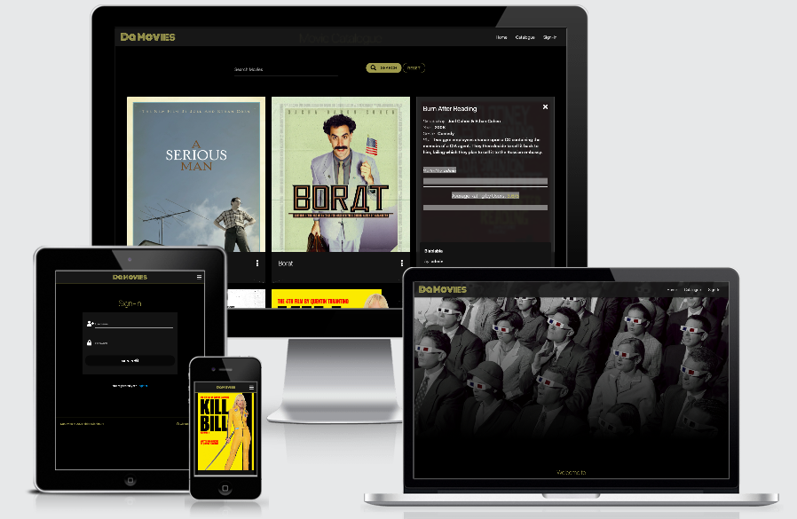

[Link to the live site on Heroku](http://milestone-project-3-damovies.herokuapp.com/)

<br>

#### Overview

<br>

This is "DaMovies", a website dedicated to cinema lovers who want to share opinions on their favourite movies and discover new ones! Once they have created their account, users can add, comment and rate movies in the catalogue.

---

### Table of Contents

<br>

- [UX](#ux)
    - User Stories
    - Strategy
    - Design
    - Wireframes
- [Features](#features)
- [Database](#database)
- [Technologies Used](#technologies-used)
    - Languages
    - Integration
    - Workspace, version control, repository storage and deployment
- [Resources](#resources)
    - Sources of knowledge
    - Other resources
- [Code Validation](#code-validation)
    - Testing
    - Solved bugs
    - Unsolved bugs
- [Deployment](#deployment)
    - Requirements to deploy
    - Forking the GitHub Repository
    - Making a local clone of the GitHub Project
    - Making a local clone of the GitHub Project
- [Credits](#credits)
    - Media
    - Content
    - Code
    - Acknowledgement

<br>

--- 

## UX

<br>

The service is aimed at an english-speaking audience that wants to watch new movies and share their thoughts on movies they've seen before.

<br>

### User Stories 

<br>

- As a first time visitor
    - I want to easily understand the main purpose of the site
    - I want the site navigation to be intutive and user friendly
    - I want to easily access the movies' catalogue
    - I want to create an account to become part of the website community 
    - I want to see information about movies in the catalogue (i.e. director, year of release)
    - I want to see the audience rating of movies in the catalogue
    - I want to add my rating
    - I want to see other users comments on movies in the catalogue
    - I want to add my own comment
    - I want to add movies that I like to the catalogue 
    - I want to be able to edit information of the movies I have uploaded in the catalogue
    - I want to be able to delete movies I have uploaded

- As a returning and/or frequent visitor
    - I want to easily sign-in in to the website
    - When I have questions about the website, I want to find information about the website owner/administrator  

<br>

### Strategy 

<br>

#### Project Goals:
- To provide users with a web application where to share and discuss movies (via CRUD operations):
    - Create: By adding movies to the catalogue
    - Read: By searching and filtering movies in the catalogue
    - Update: By editing, commenting and rating existing movies in the catalogue
    - Delete: By deleting movies uploaded in the catalogue
- To increase traffic and expand the website community
- Developing a partnership with streaming services as a future goal 

#### Customer Goals:
- To find new movies to watch
- To see other users' reviews about the movies from the catalogue
- To rate and comment movies I have already watched
- To contribute to the website community by adding new movies to the catalogue
- To navigate the website smoothly and intuitively.

<br>

### Design  

<br>

#### Colors 

The color scheme for the website consist of three main colours: black, gold and white. Black is used as based colour for the website, gold for texts, buttons and decorations, and white for texts and icons. Grey shades are also used to differentiate certain elements from the black background (i.e. navbar, forms and buttons). 

Combining black and gold seemed like the right choice to create a classy cinematic feel for the website. Using white creates contrast with the black background and keeps text as readable as possible.


-  `#c7bc65`
-  `#ffffff`
-  `#000000`
-  `#131313`
-  `#1a1a1a`

#### Typography

- "Monoton" for: Logo, with the intention of giving it a cinematic feel.
- "Roboto" for: for the rest of the text. This is the default font when using the Materialize library. The choice of using it was due to the fact that is simple, clean and gives the website a professional look.
- "Sans-serif" as fall-back font for every text.


#### images

- On the home page, images were chosen to give the user the feeling of being at the movies as well as add a retro look to the website. 

<br>

### Wireframes 

- [Desktop](static/docs/wireframes/desktop.pdf) 
- [Tablet](static/docs/wireframes/tablet.pdf) 
- [Mobile](static/docs/wireframes/mobile.pdf) 


<br>

--- 

## Features 

<br>

- Designed with HTML5, CSS3, JavaScript + libraries (Materialize, jQuery).


- **General features (apply to all pages except 404)**:
    - Fixed navbar on top of the page with links to:
        - Home, catalogue (for all users)
        - Sign-in/register (for not signed-in users)
        - Add movies, Profile, sign-out (for signed-in users)
        - Manage genres (for website administrator only)
    - Footer with link to home page and Github account
    - Responsive site on all devices
    - Collapsible navbar, with 'hamburger button', under 992px breakpoint 

    <br>

    

    

    <br>

- **Home page**:
    - Information about the website and its purpose.
    - Links to 'catalogue' and 'log-in/register' pages for users who have not signed-in yet.
    - Links to 'catalogue' and 'add movie' pages for users who have already signed-in. 

    <br>

    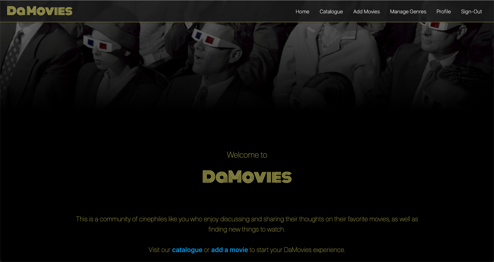
    
    <br>

- **'Catalogue' page**:
    - Search bar to look for specific movies (filtered by title or director's name).
    - List of movies with movie cover image, movie title and icon to reveal specific movie information (for all users)
        - Edit and Delete buttons (visible for users who posted the movie and administrator)
    - Movie info-card (by clicking on movie reveal icon), with:         
        - Specific information about the movie (i.e. director, plot, etc.)
        - Average rating by users on a scale from 1 to 5
        - Form with radio buttons to add rating (only for sign-in users)
        - List of users' comments
        - Text area to add comment (only for sign-in users)
    - Flash messages sections (Informs the user whether his/her actions were successfully completed, i.e. upload a movie, edit a movie, add a comment, etc.)
    <br><br>

    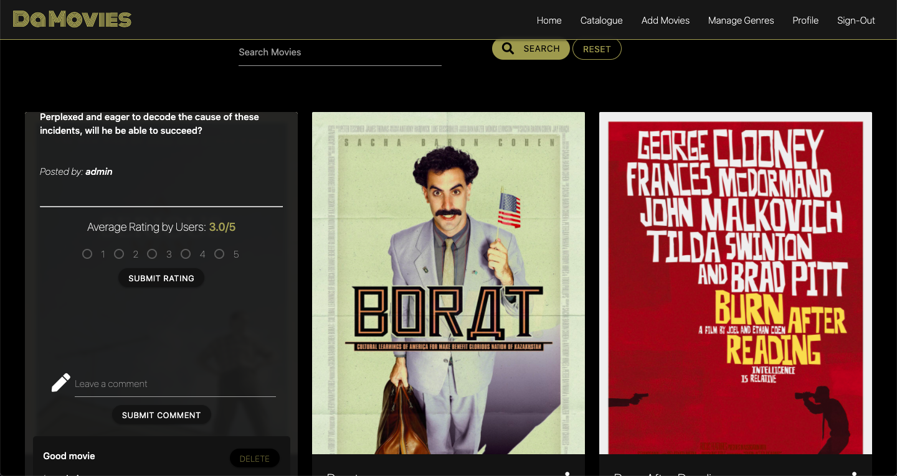

    <br>

- **'Add Movies' page (only for signed-in users)**:
    - Form where the user can provide information about the movie they want to upload:
        - Genre
        - Title
        - Director
        - Year
        - Plot 
        - Movie cover image (optional)
    - Submit button (which also redirects the user to the movie catalogue)
    - Flash messages sections (Informs the user whether his/her actions were successfully completed, i.e. upload a movie, edit a movie, add a comment, etc.)

    <br>

    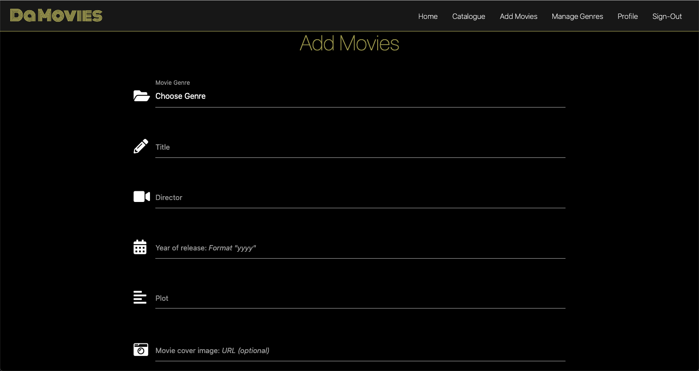


- **'Manage Genres' page (only for administrator)**:
    - 'Add genre' button (which redirects to the 'Add genres' page)
    - List of movie genres, each featured with:
        - Edit button (which redirects to the 'Edit genre' page)
        - Delete button
    - Flash messages sections (Informs the user if there is any issue, i.e. user cannot delete specific unless all movies of that genre in the catalogue are also deleted)

    <br>

    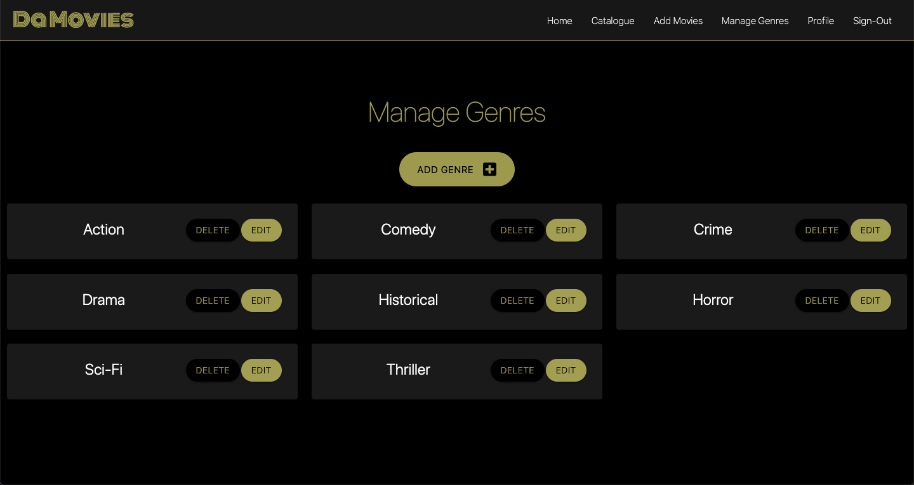

- **'Profile' page (only for signed-in users)**:
    - Section with:
        - User's username and email
        - List of movies uploaded by the user
        - Flash messages sections (To welcome the user once he/she has signed-in)

    <br>

    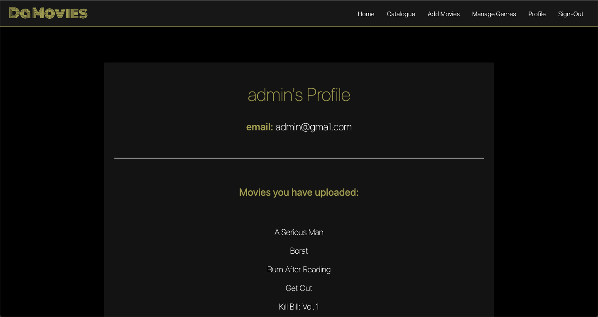

- **'Sign-in' page (only for NOT signed-in users)**:
    - Form that requires the user to insert correct username and password
    - Submit button (which also redirects the user to the profile page)
    - Link to 'Register' page
    - Flash messages sections (Informs the user if there is any issue, i.e. wrong password)

    <br>

    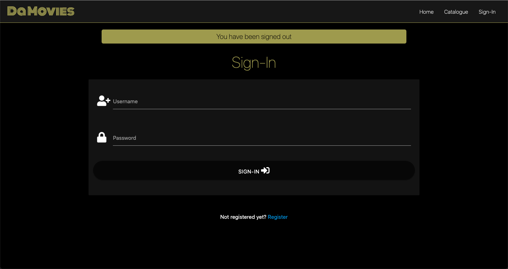

<br>

### Pages not accessible via navbar 

<br>

- **'Register' page (only for NOT signed-in users)**: Accessible via link from 'Sign-in' page 
    - Form that requires the user to insert:
        - Username
        - Email
        - Password
        - Password confirmation
    - Submit button (which also redirects the user to the profile page)
    - Flash messages sections (Informs the user if there is any issue, i.e. username already exists, passwords do not march)

    <br>

    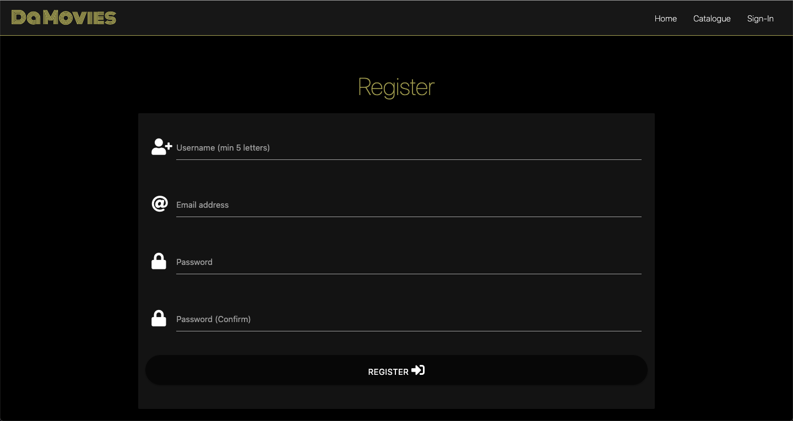

- **'Edit Movie' page (only for signed-in users)**: accessible by clickin on movie 'edit' button - see above in 'Catalogue' page
    - Form identical to the 'Add movie' page's one. However it is already filled in with the old movie infos.
    - Submit button (which also redirects the user to the movie catalogue)

    <br>

    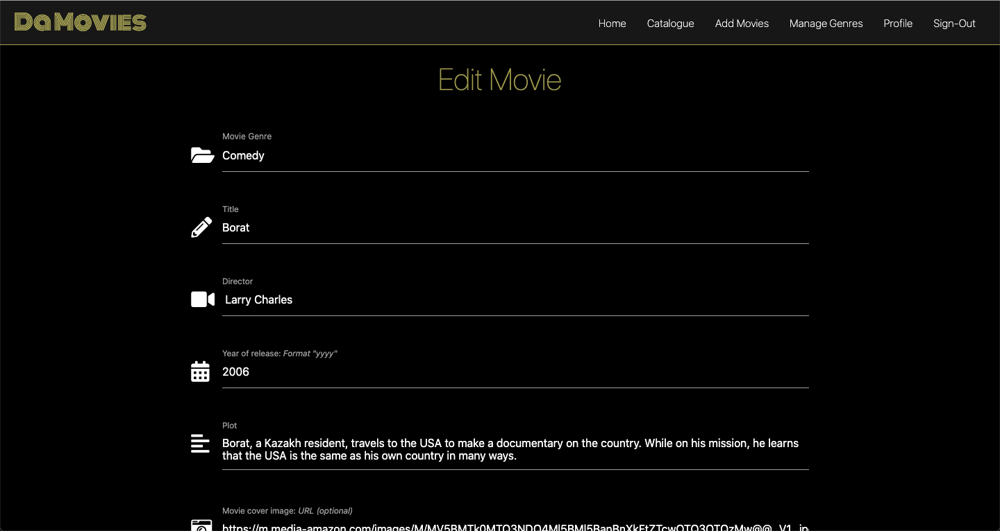

- **'Add genre' page (only for webiste administrator)**: Accessible by clicking on genre 'Add Genre' button - see above in: 'Manage Genres' page
    - Form with selected genre name to be edited
    - Submit button (which also redirects the user to the 'Manage Genres' page)

    <br>

    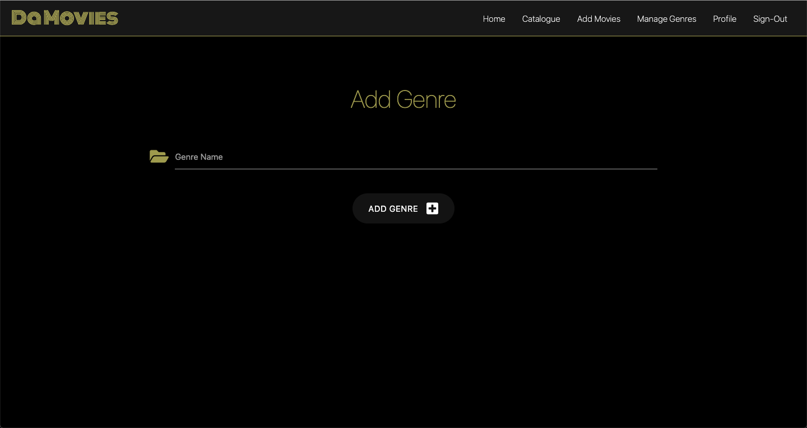

- **'Edit genre' page (only for webiste administrator)**: Accessible by clicking on genre 'edit' button - see above in: 'Manage Genres' page
    - Form with selected genre name to be edited
    - Submit button (which also redirects the user to the 'Manage Genres' page)

    <br>

    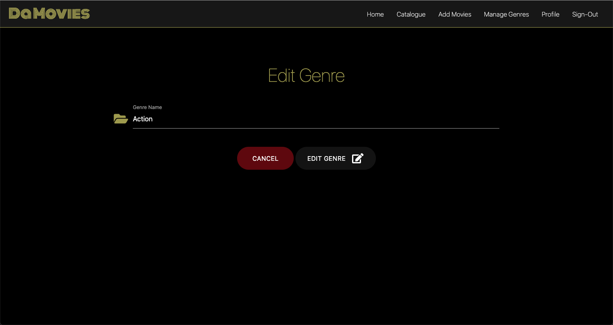


- **'Error' page**:
    - Link to home page

    <br>

    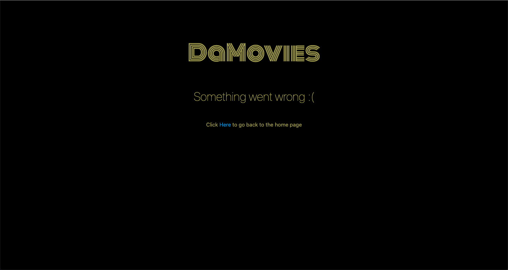

#### Future prospects

- Section where users can watch movie trailers 
- Section to show what streaming services provide the movies from the catalogue

<br>

---

## Database 

<br>

### Database Design

<br>

MongoDB Atlas is used as non-relational database for storing users, movies and genres' details. There are three collections in total. 
The 'movies' collection is associated to the other collections via object ID:
- movies.created_by = users._id
- movies.genre = genres._id

<br>

### Database schema

<br>

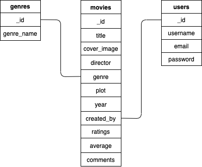

<br>

---

## Technologies Used 

<br>

#### Languages 


1. [CSS3](https://en.wikipedia.org/wiki/Cascading_Style_Sheets)
2. [HTML5](https://en.wikipedia.org/wiki/HTML5)
3. [JavaScript](https://en.wikipedia.org/wiki/JavaScript)
4. [Python](https://www.python.org)

#### Integration

1. [BSON](https://bsonspec.org)
    - bson.objectid: required dependency for MongoDB management system.
2. [Flask](https://flask.palletsprojects.com/)
    - Framework used to create and populate the templates.
3. [FontAwesome](https://fontawesome.com/)
    - Used as source of icons for the website.
4. [Google Fonts](https://fonts.google.com/) 
    - Used to import 'Monoton' font.
5. [Jinja](https://jinja.palletsprojects.com/)
    - Templating language used to simplify and display backend data in html format.
6. [jQuery](https://jquery.com/)
    - Included with Materialize and used to simplify scripts.
7. [Materialize](https://materializecss.com/)
    - Used to assist with styling and responsiveness of the website.
8. [Pymongo](https://pypi.org/project/pymongo/)
    - flask_pymongo: used to allow MongoDB database - Python interaction.
9. [Werkzeug](https://werkzeug.palletsprojects.com/)
    - Used for password hashing and authentication.


#### Workspace Version control, Repository storage and Deployment

1. [Gitpod](https://www.gitpod.io/) 
    - Used as workspace IDE (Integrated Development Environment).
2. [GitHub](https://github.com/) 
    - Hosting platform for version control, used to manage my repositories.
3. [Git](https://git-scm.com/) 
    - Version control software to record file changes and updates.
4. [Heroku](https://dashboard.heroku.com/)
    - Cloud platform used to deploy application.

#### Database Management

<br>

1. [MongoDB](https://www.mongodb.com/3)
    - Used for database functionality.
2. [MongoDB Atlas](https://www.mongodb.com/cloud/atlas) 
    - Used to host the database.

<br>

---

## Resources 

<br>

#### Sources of knowledge
- SLACK Community - Source of assistance and inspiration. 
- [Stack Overflow](https://stackoverflow.com/) - General resource. 

#### Other resources 
- [Balsamiq](https://balsamiq.com/wireframes/) - For designing wireframes.
- [TinyPNG](https://tinypng.com/) - For compression of images.
- [Google Mobile-Friendly Test](https://search.google.com/test/mobile-friendly) - To check whether the website is Mobile-friendly.

---
## Code validation 

<br>

### Testing

Testing documentation, including User Stories, can be found here: [Testing](static/docs/TESTING.md) 

<br>

#### Solved bugs

<br>

1. The website used to delete all comments and ratings attached to a movie when it was edited. To solve this problem I have adjusted the add_movie function so that it would create empty fields for "Ratings", "Average" (of ratings) and "Comments" when a new movie was added to the catalogue. Then, if a  Movie was edited, in case there were any rating or comment attached to it, I made sure the edit_movie function would keep the existing values for "Ratings", "Average" (of ratings) and "Comments". 
2. The website used to change the name of the user who posted a movie when it was edited. To solve the problem I made sure that the original name would be saved in the edit_movie function and not substituted by the name of the current user who edited the movie. 
3. When a movie genre was deleted from the genres list while still being connected to a movie, the action was causing some movies from the catalogue to switch to another genre. This problem has been solved by ensuring that the admin must take away all movies attached to a genre before deleting it.

<br>

#### Unsolved bugs

<br>

1. Sometimes, the text arena for comments on movies is not responsive and must be clicked several times before it starts working, allowing the user to type in. One way to solve the problem is to submit the message without any input so that the "Please fill in this field" would appear and the user can start writing. However, I am aware that users should be able to write a comment directly, without have to use any "trick", for a better UX.
2. Users can create different accounts using the same email.

---

## Deployment

<br>

### Requirements to deploy:

<br>

* An IDE (Gitpod)
* Python3 (To run the application and use Flask)
* PIP3 (To install all application dependencies, such as Flask and OS)
* A template folder (To link app routes using Flask)
* A could database (MongoDB Atlas)


### Forking the GitHub Repository

<br>

  By forking the GitHub Repository you make a copy of the original repository on your GitHub account to view and/or make changes without affecting the original repository. Forking requires the following steps:

  1. Log in to GitHub and locate the GitHub Repository
  2. At the top of the Repository (not top of page) just above the "Settings" Button on the menu, locate the "Fork" Button.
  3. You should now have a copy of the original repository in your GitHub account.

<br>

### Making a local clone of the GitHub Project

<br>

  1. On GitHub, navigate to the main page of the repository.
  2. Above the list of files, click the green 'Code' button.
  3. To clone the repository using HTTPS, under "Clone with HTTPS", copy the link.
  4. Open Terminal
  5. Change the current working directory to the location where you want the cloned directory to be made.
  6. Type 'git clone', and then paste the URL you copied in Step 3.
  7. Press Enter. Your local clone will be created.
  8. Install the necessary requirements from the requirements.txt file using the command `pip3 install -r requirements.txt`
  9. Create an `env.py` file where you will store the following information:

  - os.environ.setdefault`("IP", "0.0.0.0")`
  - os.environ.setdefault`("PORT", "5000")`
  - os.environ.setdefault`("SECRET_KEY", "<your_secret_key>")`
  - os.environ.setdefault`("MONGO_URI", "mongodb+srv://<username>:<password>@<cluster_name>.mongodb.net/<database>?retryWrites=true&w=majority")`
  - os.environ.setdefault`("MONGO_DBNAME", "<database_name>")`

  10. Sign up on [MongoDB](https://www.mongodb.com) and create database  (You can name it **da_movies**). The app will use the 'Collections' in the database to perform CRUD operations (the app will generate the fields, without having to do it manually in the database).
  See the database structure:

**genres**
```
    _id: <ObjectId>
    genre_name: <String>
```
**movies**
```
    _id: <ObjectId>
    title: <String>
    cover_image: <String>
    director: <String>
    genre: <ObjectId>
    plot: <String>
    year: <String>
    created_by: <ObjectId>
    ratings: <Array>

        object_number[i] : <Object>

                rating: <Int32>
                user: <ObjectId>

    average: <Object>

        _id : <string>
        average : <int32>

    comments: <Array>

        object_number[i] : <Object>

            comment: <string>
            user: <string>
```
**users**
```
    _id: <ObjectId>
    username: <string>
    email: <string>
    password: <string>
```

<br>

### Remote Deployment on Heroku

<br>

1. Create a requirement.txt file to allow Heroku to install the required dependencies to run the app. Type the following in the CLI: `pip3 freeze --local > requirements.txt`
2. Create a Procfile to inform Heroku about the type of app is being deployed by typing the following in the CLI: `echo web: python run.py > Procfile`.
3. Do git add and git commit for the new requirements and Procfile. Then git push the project to GitHub.
4. Create a Heroku account, or sign in if you already have one. Once signed in click the "New" button on the dashboard to create a new app.
5. Name the app and specify the region based on where you live (America or Europe). 
6. From the app dashboard, navigate to the "Deploy" tab.
7. From deployment method options select "Github". Then click "Search" and select your repository name. Once found, click "Connect".
8. After you connected your repository, click on the "Settings" tab on the app dashboard, click on "Reveal Config Vars" and add your configuration variables to Heroku as shown below:
 - IP: `0.0.0.0`
 - PORT: `5000`
 - MONGO_URI: `mongodb+srv://<username>:<password>@<cluster_name>.mongodb.net/<database>?retryWrites=true&w=majority`
 - SERCET_KEY: `<your_value>`
9. Navigate to the "Deploy" tab, and from Manual deploy choose your master branch. Then click "Deploy Branch".
10. After you deployed your branch select "Enable Automatic Deploys".
11. The website is now successfully deployed.


---

## Credits

<br>

#### Media 

- Pictures for home page were retrived from: 
    - [Indiewire](https://www.indiewire.com/2014/01/why-white-people-dont-like-black-movies-162548/) 
    - [WIRED](https://www.wired.com/2014/08/sin-city-review/)

#### Content 

- Information about movies were taken from: 
    - [Google](https://www.google.com/)
    
#### Code 

- Code sources:
    - [Stack Overflow](https://stackoverflow.com/)
    - Code Institute tutorial: Flask - Task Manager Project.

#### Acknowledgement

- Thanks to my mentor: Antonio Rodriguez, for his support and feedback.
- Thanks to the Slack community for providing essential knowledge.
